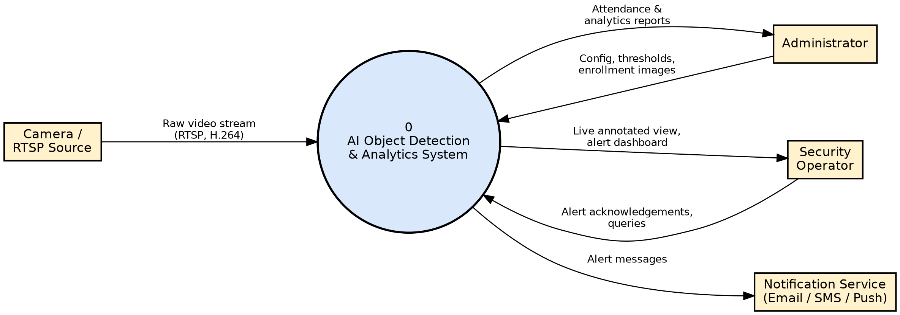
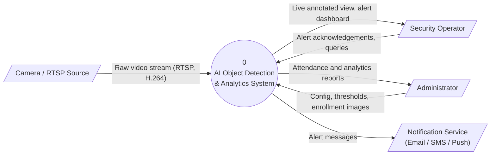
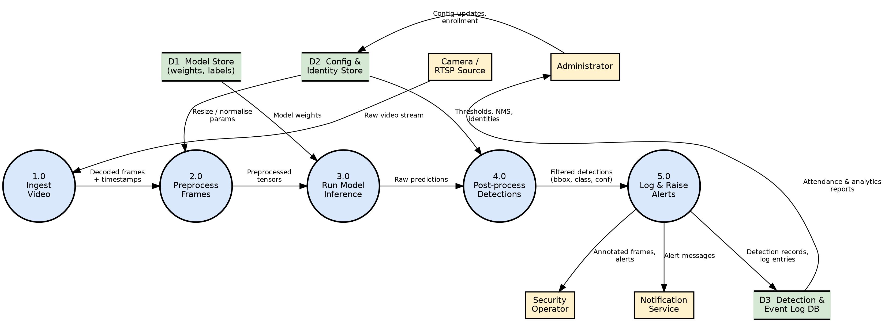
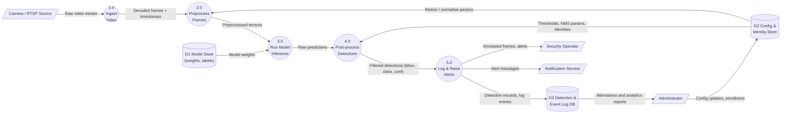
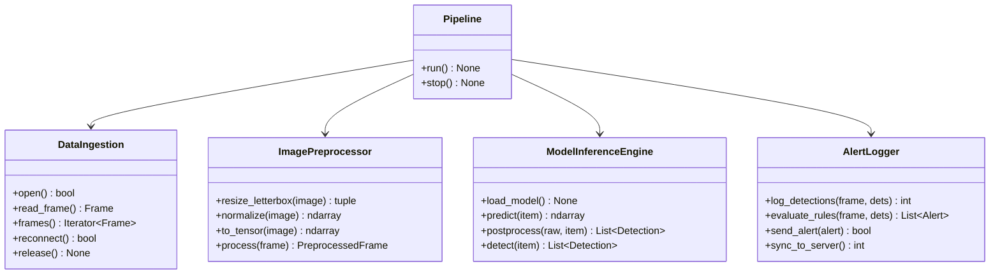

# ARCHITECTURE.md — System Design Specification

**Project:** SmartVision — AI Object Detection, Attendance & Surveillance Analytics System
**Course:** AI Project Design and Development (AI-316), Air University Islamabad
**Lab:** 02 — System Requirements & Software Architecture for AI Projects
**Author:** Eraj Jamil (Roll No. 231208)
**Lab Instructor:** Farhan Zafar Kayani
**Repository:** https://github.com/erajjamil137/aipdd_lab01

---

## Table of Contents
1. [Introduction](#1-introduction)
2. [Functional & Non-Functional Requirements](#2-functional--non-functional-requirements)
3. [System Boundary, Actors and Input/Output Mapping](#3-system-boundary-actors-and-inputoutput-mapping)
4. [Data-Flow Diagrams](#4-data-flow-diagrams)
5. [Modular Software Architecture](#5-modular-software-architecture)
6. [Traceability Matrix](#6-traceability-matrix)
7. [Repository Layout](#7-repository-layout)

---

## 1. Introduction
SmartVision is an edge-deployed computer-vision system that ingests live camera streams, detects and recognises people/objects with a deep-learning model, records attendance, and raises alerts for suspicious events. This document specifies the requirements, system boundary, data flow and modular design that guide implementation.

---

## 2. Functional & Non-Functional Requirements

### 2.1 Functional Requirements
| ID | Requirement | Description | Acceptance Criteria | Priority |
|---|---|---|---|---|
| FR-01 | Face Detection & Recognition | The system shall detect every face in each processed frame and match it against enrolled identities. | Detection + recognition latency <= 100 ms per frame on the edge device; unknown faces labelled UNKNOWN. | High |
| FR-02 | Attendance Logging | The system shall record person ID, camera ID, timestamp and confidence for each recognised person. | One attendance row per person per 10-minute window (duplicates suppressed); 100% of recognised events stored. | High |
| FR-03 | Database Synchronisation | The system shall synchronise local records with the central database and queue data while offline. | Sync every 60 s; no data loss after a 1-hour network outage; retries with back-off. | High |
| FR-04 | Identity Enrollment | An administrator shall be able to enrol, update and delete a person using at least 5 face images. | Enrolment completes in < 30 s; embeddings stored; deleted person removed from all stores. | Medium |
| FR-05 | Alerts & Reporting | The system shall raise alerts for unknown faces / restricted-zone entry and generate daily attendance reports. | Alert delivered within 3 s of detection; daily report exported as CSV/PDF by 00:05. | Medium |


### 2.2 Non-Functional Requirements
| ID | Category | Requirement | Metric / Threshold | Priority |
|---|---|---|---|---|
| NFR-01 | Performance | Minimum frame rate | End-to-end >= 15 FPS per stream on the edge device (1080p input). | High |
| NFR-02 | Accuracy | Model accuracy thresholds | Detector mAP@0.5 >= 0.85; face recognition accuracy >= 95% with false-accept rate <= 1%. | High |
| NFR-03 | Resource / Power | Edge device power & memory | Power draw <= 15 W; RAM <= 4 GB; GPU memory <= 2 GB. | High |
| NFR-04 | Security & Privacy | Data privacy | Face embeddings encrypted (AES-256); TLS 1.2+ in transit; role-based access; raw frames deleted after 24 h; records kept <= 90 days. | High |
| NFR-05 | Reliability | Availability & recovery | 99% uptime; automatic restart within 30 s of a crash; automatic stream reconnect within 10 s. | Medium |


---

## 3. System Boundary, Actors and Input/Output Mapping

### 3.1 System Actors
| ID | Actor | Type | Role |
|---|---|---|---|
| A1 | Security Operator | Human (primary) | Monitors live view, acknowledges alerts, reviews detections. |
| A2 | Administrator | Human (primary) | Configures cameras and thresholds, enrols identities, exports reports, manages users. |
| A3 | Automated Trigger System | System (secondary) | Motion / schedule / PIR sensor triggers that start or wake stream processing. |
| A4 | Camera / RTSP Source | External device | Supplies the continuous raw video stream. |
| A5 | Notification Service | External system | Delivers email / SMS / push alerts to operators. |
| A6 | Central Database Server | External system | Receives synchronised attendance and event records. |


### 3.2 System Inputs
| ID | Input | Source | Format / Parameters | Notes |
|---|---|---|---|---|
| I1 | RTSP video stream | IP camera (A4) | H.264/H.265, 1920x1080, 15-25 FPS, ~4 Mbps | Resized to 640x640 for the model. |
| I2 | Sensor / trigger parameters | Trigger system (A3) | Motion flag, schedule window, PIR signal (JSON) | Starts or pauses inference. |
| I3 | Configuration file | Administrator (A2) | YAML: confidence/NMS thresholds, camera list, alert rules | Loaded at start-up and on change. |
| I4 | Enrollment images | Administrator (A2) | JPEG/PNG, >= 5 images per person, face >= 112x112 px | Converted to embeddings. |
| I5 | Model weights | Model store (D1) | YOLO .pt / .onnx, <= 100 MB | Loaded once at start-up. |
| I6 | Operator commands | Operator (A1) | Acknowledge alert, query logs, filter by camera/date | Via dashboard. |


### 3.3 System Outputs
| ID | Output | Destination | Format | Example |
|---|---|---|---|---|
| O1 | Bounding box coordinates | Dashboard / log | [x1, y1, x2, y2, conf, class_id] in original-frame pixels | [412, 130, 560, 318, 0.91, 0] |
| O2 | Alert notifications | Operator, Notification Service (A5) | Text + snapshot, severity INFO/WARNING/CRITICAL | UNKNOWN_FACE at Cam-02, 10:42:07 |
| O3 | Log entries | Event Log DB (D3) | JSON / SQL row: timestamp, camera_id, class, confidence, identity | {ts, cam, class, conf, id} |
| O4 | Attendance records | Central DB (A6) | Person ID, timestamp, camera ID, status | 231208, 2026-10-04 09:01, Cam-01, PRESENT |
| O5 | Annotated live view | Operator dashboard | MJPEG / WebRTC stream with boxes and labels | Real-time overlay |
| O6 | Daily / analytics report | Administrator (A2) | CSV / PDF | attendance_2026-10-04.csv |


### 3.4 Operational Constraints
| ID | Constraint | Limit | Rationale |
|---|---|---|---|
| C1 | Memory footprint | <= 4 GB RAM and <= 2 GB GPU memory in total | Edge device limit |
| C2 | Network bandwidth | <= 4 Mbps per camera stream; <= 1 Mbps upload for sync | Shared site network |
| C3 | Latency | Capture-to-alert <= 3 s; per-frame inference <= 100 ms | Real-time response |
| C4 | Power | <= 15 W sustained | Fanless edge enclosure |
| C5 | Storage | <= 64 GB local; raw frames retained <= 24 h | Local SSD size and privacy policy |
| C6 | Compliance | No face data leaves the site unencrypted | Privacy requirement |
| C7 | Software | Python 3.10+; runs on Linux/Windows; offline-capable | Deployment environment |


### 3.5 System Boundary
| In Scope | Out of Scope |
|---|---|
| Video ingestion and decoding | Camera hardware and network infrastructure |
| Frame preprocessing | Central database server internals |
| Model inference (detection / recognition) | Email / SMS gateway internals |
| Post-processing, logging, alert generation | Model training (done offline in separate pipeline) |
| Operator dashboard and report export | Physical access-control hardware (doors, barriers) |
| Local storage and synchronisation client |  |


---

## 4. Data-Flow Diagrams
Notation: **rectangle** = external entity, **circle** = process, **open-ended bars** = data store, **arrow** = data flow.

### 4.1 Level 0 — Context Diagram




### 4.2 Level 1 DFD




| Process | Description |
|---|---|
| 1.0 Ingest Video | Receives the RTSP stream, decodes frames, adds timestamp and camera ID |
| 2.0 Preprocess Frames | Letterbox resize to 640x640, normalise, convert to tensor |
| 3.0 Run Model Inference | Loads weights from D1 and produces raw predictions |
| 4.0 Post-process Detections | Confidence filtering, NMS, mapping boxes to original pixels, identity matching |
| 5.0 Log & Raise Alerts | Writes records to D3, evaluates alert rules, notifies operator and notification service |

---

## 5. Modular Software Architecture

### 5.1 Module Overview
| Module | Responsibility | Key Methods | Input | Return |
|---|---|---|---|---|
| DataIngestion | Connect to camera, decode frames, reconnect, rate-limit | open(), read_frame(), frames(), reconnect(), release() | Source URI (str), camera_id | Frame / Iterator[Frame] / None |
| ImagePreprocessor | Letterbox resize, colour conversion, normalise, tensor | resize_letterbox(), normalize(), to_tensor(), process() | Frame | PreprocessedFrame (1x3x640x640 float32) |
| ModelInferenceEngine | Load model, forward pass, confidence filter + NMS, map boxes | load_model(), predict(), postprocess(), detect(), unload() | PreprocessedFrame | np.ndarray (N,6) / List[Detection] |
| AlertLogger | Persist detections, evaluate rules, send alerts, sync | log_detections(), evaluate_rules(), send_alert(), log_attendance(), sync_to_server() | Frame + List[Detection], Alert | int / List[Alert] / bool |
| Pipeline | Orchestrate the four modules in a loop | run(), stop() | Module instances | None |


### 5.2 Class Diagram


### 5.3 Interface Source Files (`src/`)

#### `schemas.py`
```python
"""Shared data structures passed between pipeline modules."""
from __future__ import annotations

from dataclasses import dataclass, field
from datetime import datetime
from typing import Dict, List, Optional, Tuple

import numpy as np


@dataclass
class Frame:
    """A single decoded video frame."""
    image: np.ndarray            # BGR image, shape (H, W, 3), dtype uint8
    timestamp: datetime          # capture time
    camera_id: str               # source camera identifier
    frame_id: int                # monotonically increasing counter


@dataclass
class PreprocessedFrame:
    """Model-ready tensor plus the metadata needed to map results back."""
    tensor: np.ndarray           # float32, shape (1, 3, H_in, W_in), values in [0, 1]
    original_shape: Tuple[int, int]   # (H, W) of the source frame
    scale: float                 # resize ratio used (letterbox)
    pad: Tuple[int, int]         # (pad_x, pad_y) added by letterbox
    source: Frame


@dataclass
class Detection:
    """One detected object in original-frame pixel coordinates."""
    bbox: Tuple[float, float, float, float]   # (x1, y1, x2, y2)
    confidence: float
    class_id: int
    class_name: str
    identity: Optional[str] = None            # recognised person ID, if any


@dataclass
class Alert:
    """An event that must be pushed to operators."""
    alert_type: str              # e.g. "UNKNOWN_FACE", "RESTRICTED_ZONE"
    severity: str                # "INFO" | "WARNING" | "CRITICAL"
    message: str
    camera_id: str
    timestamp: datetime
    detections: List[Detection] = field(default_factory=list)
    metadata: Dict[str, str] = field(default_factory=dict)
```

#### `data_ingestion.py`
```python
"""DataIngestion: connects to camera sources and yields decoded frames."""
from __future__ import annotations

from typing import Iterator, Optional

from schemas import Frame


class DataIngestion:
    """Reads frames from an RTSP stream, video file or webcam.

    Responsibilities:
        * open/close the video source and auto-reconnect on stream loss
        * decode frames and attach timestamp / camera_id / frame_id
        * enforce a target FPS by dropping stale frames (never block the pipeline)
    """

    def __init__(self, source_uri: str, camera_id: str, target_fps: int = 15,
                 reconnect_attempts: int = 5) -> None:
        """
        Args:
            source_uri: RTSP URL, file path or device index (as string).
            camera_id: unique ID stored with every frame.
            target_fps: maximum frames per second delivered downstream.
            reconnect_attempts: retries before raising ConnectionError.
        """
        self.source_uri = source_uri
        self.camera_id = camera_id
        self.target_fps = target_fps
        self.reconnect_attempts = reconnect_attempts

    def open(self) -> bool:
        """Open the video source. Returns True on success."""
        raise NotImplementedError

    def read_frame(self) -> Optional[Frame]:
        """Return the next Frame, or None if the stream ended / read failed."""
        raise NotImplementedError

    def frames(self) -> Iterator[Frame]:
        """Generator that yields frames until the source is closed."""
        raise NotImplementedError

    def reconnect(self) -> bool:
        """Try to re-open a dropped stream. Returns True if recovered."""
        raise NotImplementedError

    def is_opened(self) -> bool:
        """True while the underlying capture is open."""
        raise NotImplementedError

    def release(self) -> None:
        """Release the capture handle and free resources."""
        raise NotImplementedError
```

#### `image_preprocessor.py`
```python
"""ImagePreprocessor: converts raw frames into model-ready tensors."""
from __future__ import annotations

from typing import Tuple

import numpy as np

from schemas import Frame, PreprocessedFrame


class ImagePreprocessor:
    """Resize (letterbox), colour-convert and normalise frames."""

    def __init__(self, input_size: Tuple[int, int] = (640, 640),
                 mean: Tuple[float, float, float] = (0.0, 0.0, 0.0),
                 std: Tuple[float, float, float] = (1.0, 1.0, 1.0)) -> None:
        """
        Args:
            input_size: (width, height) expected by the model.
            mean / std: per-channel normalisation constants (RGB order).
        """
        self.input_size = input_size
        self.mean = mean
        self.std = std

    def resize_letterbox(self, image: np.ndarray) -> Tuple[np.ndarray, float, Tuple[int, int]]:
        """Resize keeping aspect ratio and pad to input_size.

        Returns:
            (resized_image, scale, (pad_x, pad_y))
        """
        raise NotImplementedError

    def normalize(self, image: np.ndarray) -> np.ndarray:
        """BGR->RGB, scale to [0, 1], apply mean/std. Returns float32 HWC array."""
        raise NotImplementedError

    def to_tensor(self, image: np.ndarray) -> np.ndarray:
        """HWC -> NCHW float32 tensor with batch dimension of 1."""
        raise NotImplementedError

    def process(self, frame: Frame) -> PreprocessedFrame:
        """Full pipeline: letterbox -> normalise -> tensor."""
        raise NotImplementedError
```

#### `model_inference_engine.py`
```python
"""ModelInferenceEngine: loads the detector and runs prediction."""
from __future__ import annotations

from typing import List

import numpy as np

from schemas import Detection, PreprocessedFrame


class ModelInferenceEngine:
    """Wraps the AI model (e.g. YOLO) behind a framework-independent API."""

    def __init__(self, model_path: str, device: str = "cpu",
                 conf_threshold: float = 0.5, iou_threshold: float = 0.45,
                 class_names: List[str] | None = None) -> None:
        """
        Args:
            model_path: path to weights (.pt / .onnx).
            device: "cpu", "cuda:0", etc.
            conf_threshold: minimum confidence to keep a detection.
            iou_threshold: IoU threshold used by non-maximum suppression.
            class_names: label list indexed by class_id.
        """
        self.model_path = model_path
        self.device = device
        self.conf_threshold = conf_threshold
        self.iou_threshold = iou_threshold
        self.class_names = class_names or []
        self.model = None

    def load_model(self) -> None:
        """Load weights into memory and warm up the model."""
        raise NotImplementedError

    def predict(self, item: PreprocessedFrame) -> np.ndarray:
        """Run a forward pass. Returns raw predictions, shape (N, 6):
        [x1, y1, x2, y2, confidence, class_id] in model-input coordinates."""
        raise NotImplementedError

    def postprocess(self, raw: np.ndarray, item: PreprocessedFrame) -> List[Detection]:
        """Apply confidence filter + NMS and map boxes back to original pixels."""
        raise NotImplementedError

    def detect(self, item: PreprocessedFrame) -> List[Detection]:
        """Convenience: predict() followed by postprocess()."""
        raise NotImplementedError

    def unload(self) -> None:
        """Free model memory / GPU resources."""
        raise NotImplementedError
```

#### `alert_logger.py`
```python
"""AlertLogger: persists detections and dispatches alerts."""
from __future__ import annotations

from typing import List, Optional

from schemas import Alert, Detection, Frame


class AlertLogger:
    """Writes log entries to the database and raises operator alerts."""

    def __init__(self, db_path: str = "logs/events.db",
                 notify_channels: List[str] | None = None,
                 dedup_window_s: int = 600) -> None:
        """
        Args:
            db_path: SQLite / DB connection string for the event log.
            notify_channels: e.g. ["email", "sms", "dashboard"].
            dedup_window_s: ignore identical alerts inside this window (seconds).
        """
        self.db_path = db_path
        self.notify_channels = notify_channels or ["dashboard"]
        self.dedup_window_s = dedup_window_s

    def log_detections(self, frame: Frame, detections: List[Detection]) -> int:
        """Store detections for a frame. Returns number of rows written."""
        raise NotImplementedError

    def evaluate_rules(self, frame: Frame, detections: List[Detection]) -> List[Alert]:
        """Apply alert rules (unknown face, restricted zone, ...) and return alerts."""
        raise NotImplementedError

    def send_alert(self, alert: Alert) -> bool:
        """Dispatch an alert to all channels. Returns True if delivered."""
        raise NotImplementedError

    def log_attendance(self, person_id: str, camera_id: str, timestamp) -> bool:
        """Record attendance once per dedup window. Returns True if a new row was added."""
        raise NotImplementedError

    def sync_to_server(self) -> int:
        """Push unsynced rows to the central DB. Returns rows synced."""
        raise NotImplementedError

    def get_recent(self, limit: int = 50) -> List[dict]:
        """Fetch the most recent log entries for the dashboard."""
        raise NotImplementedError
```

#### `pipeline.py`
```python
"""Pipeline: wires the four modules together (orchestration layer)."""
from __future__ import annotations

from alert_logger import AlertLogger
from data_ingestion import DataIngestion
from image_preprocessor import ImagePreprocessor
from model_inference_engine import ModelInferenceEngine


class Pipeline:
    """Ingest -> Preprocess -> Infer -> Log/Alert loop."""

    def __init__(self, ingestion: DataIngestion, preprocessor: ImagePreprocessor,
                 engine: ModelInferenceEngine, logger: AlertLogger) -> None:
        self.ingestion = ingestion
        self.preprocessor = preprocessor
        self.engine = engine
        self.logger = logger

    def run(self) -> None:
        """Main loop: for each frame, detect objects, log them and raise alerts."""
        raise NotImplementedError

    def stop(self) -> None:
        """Graceful shutdown of all modules."""
        raise NotImplementedError
```

---

## 6. Traceability Matrix
| Requirement | Realised by (Module / Process) |
|---|---|
| FR-01 Face detection & recognition | ModelInferenceEngine (3.0, 4.0) |
| FR-02 Attendance logging | AlertLogger.log_attendance (5.0, D3) |
| FR-03 Database synchronisation | AlertLogger.sync_to_server (D3) |
| FR-04 Identity enrollment | Configuration & Identity Store (D2) |
| FR-05 Alerts & reporting | AlertLogger.evaluate_rules / send_alert (5.0) |
| NFR-01 Frame rate | DataIngestion frame dropping, ImagePreprocessor |
| NFR-02 Accuracy | ModelInferenceEngine thresholds and model choice |
| NFR-03 Power / memory | Model size, input resolution, batch size 1 |
| NFR-04 Privacy & security | AlertLogger storage policy, encrypted D2/D3 |
| NFR-05 Reliability | DataIngestion.reconnect, Pipeline.stop |


---

## 7. Repository Layout
```
aipdd_lab01/
├── ARCHITECTURE.md
├── diagrams/
│   ├── dfd_level0.mmd / dfd_level0.png
│   └── dfd_level1.mmd / dfd_level1.png
└── src/
    ├── schemas.py
    ├── data_ingestion.py
    ├── image_preprocessor.py
    ├── model_inference_engine.py
    ├── alert_logger.py
    └── pipeline.py
```
